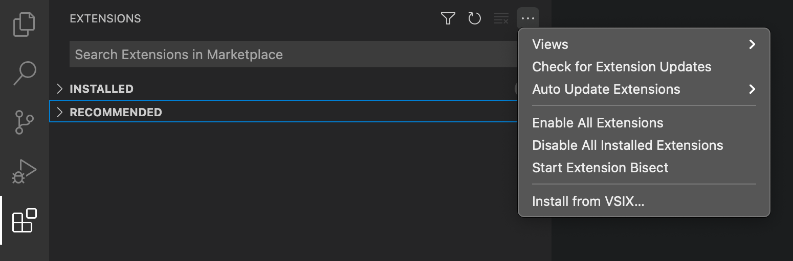

# Vocab VSCode Extension

Helper extension for the [Vocab](https://github.com/seek-oss/vocab) i18n framework.

## WARNING: This is still a work in progress. Use with caution.

## How to install

This addon is currently not on the vscode marketplace, so you need to install the addon manually:

1. Download the `vocabhelper-x.x.x.vsix` file from the [releases page](https://github.com/askoufis/vocab-vscode-extension/releases).
2. In the "Extensions" tab in VSCode, click the three dots and select the "Install from VSIX" item from the menu
   

## Features

- Copy a string directly into the nearest `translations.json` file, wrapping the string with the `t` translation hook
- Automatically create a `translations.json` and/or `.vocab` folder if they don't already exist
- Automatically import vocab if it's not already imported
- Open the nearest translations file relative to the current component

## Commands

This extension contributes the following commands:

- `vocabHelper.extractTranslationString`: extract the currently highlighted string into the nearest `translations.json` file, creating the file if necessary
- `vocabHelper.openTranslationsFile`: open the `translations.json` file for the current component

## Settings

This extension has the following configuration settings:

- `vocabHelper.formatSaveTranslationOnExtract`: **Warning: When enabled, this setting causes a window to be open and closed very quickly, which may be quite jarring for some users.**
  Format and save the `translations.json` file after adding the extracted string. When enabled, the `translation.json` file will be opened in your editor, saved (and formatted if auto-formatting JSON files is enabled), and then closed.

## Release Notes

See [`CHANGELOG.md`](./CHANGELOG.md)
