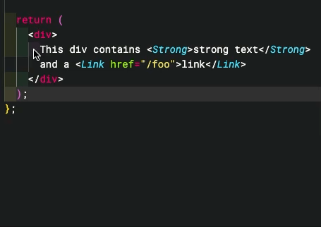

# Vocab Helper

Helper extension for the [Vocab][vocab] i18n framework.

## WARNING: This is still a work in progress. Use with caution.

## How to install

To install the extension, visit the [extension page](https://marketplace.visualstudio.com/items?itemName=askoufis.vocabhelper) and click install.
Alternatively, search for `Vocab helper` in the extensions tab of VSCode and install it from there.

If you have previously installed the addon via a `.vsix` file from the releases page, please uninstall the addon
and re-install the version from the VSCode marketplace. The versions in the releases section of the github page are now out of date.
From now on all versions of the addon will be published to the vscode marketplace.

## Features

- ✨Automatically extract the highlighted text into the nearest `translations.json` file, wrapping the string with the `t` translation hook✨
- Automatically create a `translations.json` and/or `.vocab` folder if they don't already exist
- Automatically import [vocab] if it's not already imported
- Open the nearest translations file relative to the current component

## Commands

This extension contributes the following commands:

- `vocabHelper.extractTranslationString` (default hotkey Ctrl + Alt + T on Windows/Linux, Ctrl + Option + T on MacOS): extract the currently highlighted string into the nearest `translations.json` file, creating the file if necessary
- `vocabHelper.openTranslationsFile`: open the `translations.json` file for the current component

## Configuration

- `vocabHelper.maxTranslationKeyLength`: Truncate translation keys longer than a specified maximum length
- `vocabHelper.formatAfterReplace` (defaults to `false`): Format the current document after replacing the highlighted translation string

## Showcase

Extract text

Extract text with a variable

Extract text with JSX

It even handles deeply nested JSX!

## Release Notes

See [`CHANGELOG.md`](./CHANGELOG.md)

## Contributing

### Running the extension locally

1. Clone the repo
2. Run `pnpm` to install dependencies
3. Run the `Extension Tests` launch configuration to make sure everything is working
4. Run the `Run Extension` launch config to start a separate VSCode instance that's running the extension code from your local repo

[vocab]: https://github.com/seek-oss/vocab
